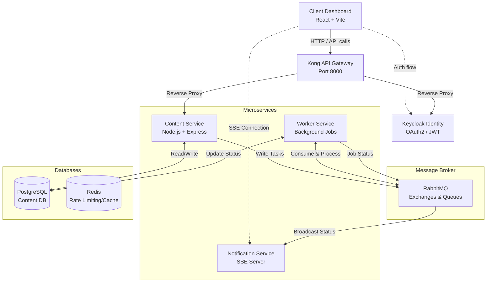

# 🚀 Content Processing Platform

[](https://www.typescriptlang.org/)
[](https://nodejs.org/)
[](https://reactjs.org/)
[](https://www.docker.com/)
[](https://www.rabbitmq.com/)
[](https://www.postgresql.org/)
[](https://www.keycloak.org/)
[](https://konghq.com/)

A scalable, event-driven microservices platform built to handle heavy content processing workflows (such as text extraction and summarization) asynchronously. The system leverages modern backend architecture patterns including an API Gateway, OAuth2 Identity Management, publish/subscribe messaging, and Server-Sent Events (SSE) for real-time frontend updates.

---

## System Architecture

The overarching infrastructure comprises independent services orchestrated entirely via Docker Compose.



## Tech Stack & Core Technologies

- **Frontend Application**
  - **React 19 & Vite:** Fast, modern single-page dashboard.
  - **Tailwind CSS v4:** Utility-first styling with a custom beautiful design language.
  - **Real-Time Data:** Server-Sent Events (SSE) combined with continuous polling fallbacks using TanStack React Query.

- **Microservices (Backend)**
  - **Node.js, Express & TypeScript:** Strongly-typed server environments.
  - **Prisma ORM:** Single shared schema definition spanning across multiple services seamlessly.
  - **PostgreSQL:** Primary ACID database storing structured job logs and extracted outputs.

- **Infrastructure & Orchestration**
  - **Docker & Docker Compose:** Containerizes 8+ interdependent services with internal custom networks.
  - **RabbitMQ:** Asynchronous message broker handling high-throughput job queuing (Direct mapping) and system-wide fanout capabilities to pipe results instantly.
  - **Kong API Gateway (DB-less):** Provides a single entry-point abstraction for external consumers and the dashboard.
  - **Keycloak:** Enterprise-grade Identity and Access Management for issuing scoped JWTs via the OAuth2 Password Flow.

## Services Breakdown

1. **`client-dashboard`**: A React application featuring a drag-and-drop file uploader, live stats, and real-time Toast notifications to alert users the second their background job succeeds or fails.
2. **`content-service`**: Exposes secure REST endpoints (`/api/v1/content`) to initiate new processing jobs and inspect historical output. Validates incoming JWTs against the Keycloak Remote Certificate JWKS.
3. **`worker-service`**: An isolated consumer that listens to RabbitMQ queues, safely processes uploaded files (e.g., extracting or summarizing texts), and updates PostgreSQL upon completion.
4. **`notification-service`**: Features a robust SSE implementation that dynamically pipes real-time fanout metrics back to the active client dashboard, keeping users deeply engaged without aggressively polling.

---

## Getting Started (Local Development)

### 1. Start the Environment
Run everything with a single command using Docker:
```bash
docker compose up -d --build
```

*This spins up PostgreSQL, Redis, RabbitMQ, Keycloak, Kong, our 3 core services, and the React Dashboard.*

### 2. Access the Platform
- **Client Dashboard:** http://localhost:5173
- **Kong API Gateway:** http://localhost:8000
- **RabbitMQ Management:** http://localhost:15672
- **Keycloak Admin Console:** http://localhost:8080

### 3. Authentication & Test Credentials
To interact with the dashboard or utilize the localized Swagger documentation, use the pre-configured mock user credentials:

- **client_id:** `content-service`
- **client_secret:** `onfenChucD3uKFKhPuEATCyflsA0oPyB`
- **username:** `testuser`
- **password:** `password123`

### 4. API Documentation
The comprehensive OpenAPI (Swagger) documentation can be consumed locally:
- **Swagger UI:** `http://localhost:3000/api-docs`

---

## System Flow Example

1. The user logs into the dashboard (`http://localhost:5173`).
2. Vite seamlessly proxies the request to Keycloak internally to obtain a JWT.
3. The React app requests an upload task by hitting the Kong Gateway (`:8000`).
4. Kong routes this safely to `content-service`, validating the JWT signature.
5. The service uploads the file, writes a `PENDING` job into Postgres, and shoves it to RabbitMQ.
6. The `worker-service` picks the task out of the Rabbit queue, "processes" it, edits Postgres, and broadcasts the event into a fanout exchange.
7. The `notification-service` consumes the fanout and forwards it to the dashboard via SSE.
8. The dashboard instantly renders a success Toast and refreshes the Jobs Table!
